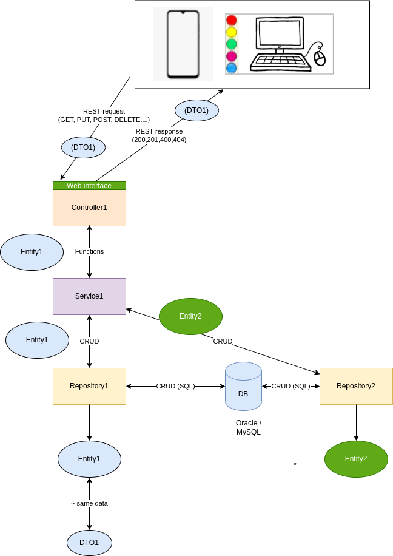

# Architektúra
A backend architektúrája az MVC elvet követi.

Az alkalmazás architektúrájának váza itt látható:

Ahogy látható, az alkalmazásban az egyedek (**Entity**) építik fel a modellt. Ezek egymással különféle kapcsolatban lehetnek (dependencia, tartalmazás, öröklés stb.), ezeknek a modellezése későbbi feladat UML-ben. Azt azonban biztosan tudjuk, hogy egymással össze vannak kötve, ahogy az a rajzon látszik is: _Entity1_ és _Entity2_ között kapcsolat van (hogy milyen, az a modellezés ezen szakaszában mindegy is). 

A kapcsolatok leírására navigation propertyt használunk, ezek lényegében referenciák a másik hivatkozott objektumre. Ezen kapcsolatok nem ritkán lehetnek (lesznek) körkörösek, amik nehezen sorosíthatók pl. JSON-be. Ennek elhárítására **DTO**-kat használ a program, amik azonos vagy kevesebb tartalommal bírnak, mint az egyedek, viszont nincs köztük körkörös függőség, így egyszerűen sorosíthatók.

Az adatokat (az egyedek reprezentációját) **adatbázis**ban tároljuk. Ez a projektben Oracle vagy MySQL adatbázis lesz. Az adatbázisban az ORM szabályok szerint tárolunk táblákban egyedeket. Az adatbázis feladata a perzisztens adattárolás.

Az adatbázissal a DAL (data access layer) kommunikál. A DAL-t a projektben a **repository**k valósítják meg. Ezen osztályok feladatai az ORM-leképezések az adatbázisból az alkalmazás memóriájába a szokásos szabályok szerint: tábla - egyed, attribútum - tagváltozó, külső kulcs - referencia. A DAL feladata tehát a CRUD műveletek elvégzése, amit a felszín alatt az adatbázissal kommunikálva SQL nyelven fogalmaz meg. Az eredeti elgondolás szerint minden egyes egyedhez tartozik egy repository, ami külön-külön kezeli a táblákat. Egy másik elgondolás szerint lehetne felvenni egy **DAO**-t (data access object), ami az összes repositoryt kiváltva egy osztály lenne. A DAO mellett az egyszerűség és az újrahasznosíthatóság szól. Az egyedi repositoryk viszont lehetőséget adnak egyedi szűrők beállítására például: tehát ha le akarunk kérni adott tulajdonságú elemet, akkor érdemes külön repositoryba írni azt a kódot.

A **service** osztályok feladatai az egyedek manipulácói, az üzleti logika megvalósítása (BLL - business logic layer). A service-ek a repositorykkal kommunikálnak CRUD műveletekkel, és azokra válaszul kap(hat)nak vissza egyedeket.

A **controller** osztályok feladata az, hogy megteremthesse a lehetőséget, hogy a külvilág kommunikáljon az alkalmazásunkkal. A controllerek biztosítják ugyanis a REST API felületét az alkalmazásunkhoz: bennük szerepelnek a REST-mappingek. A service-ekhez kérésekkel fordulnak a külvilág elemei: a mobilalkalmazás vagy a webes alkalmazás ide küld REST-kéréseket (GET, PUT, POST, DELETE stb. akár csatolt adatokkal (payload)), és ezekre válaszokat kap, akár csatolt adatokkal. A service a kéréseket a controller felé irányítja, és a visszakapott objektumokat mint DTO visszaadja a válasz részeként. 